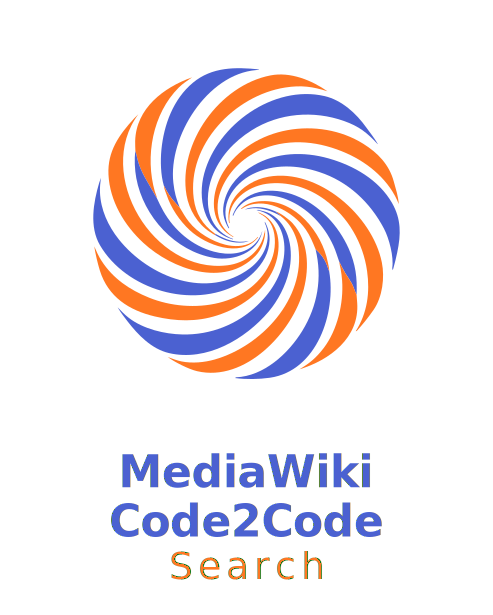
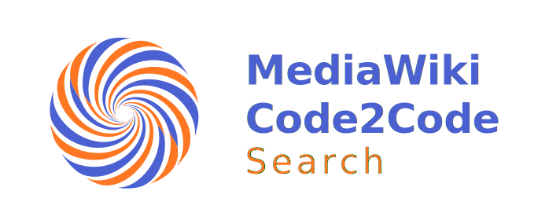
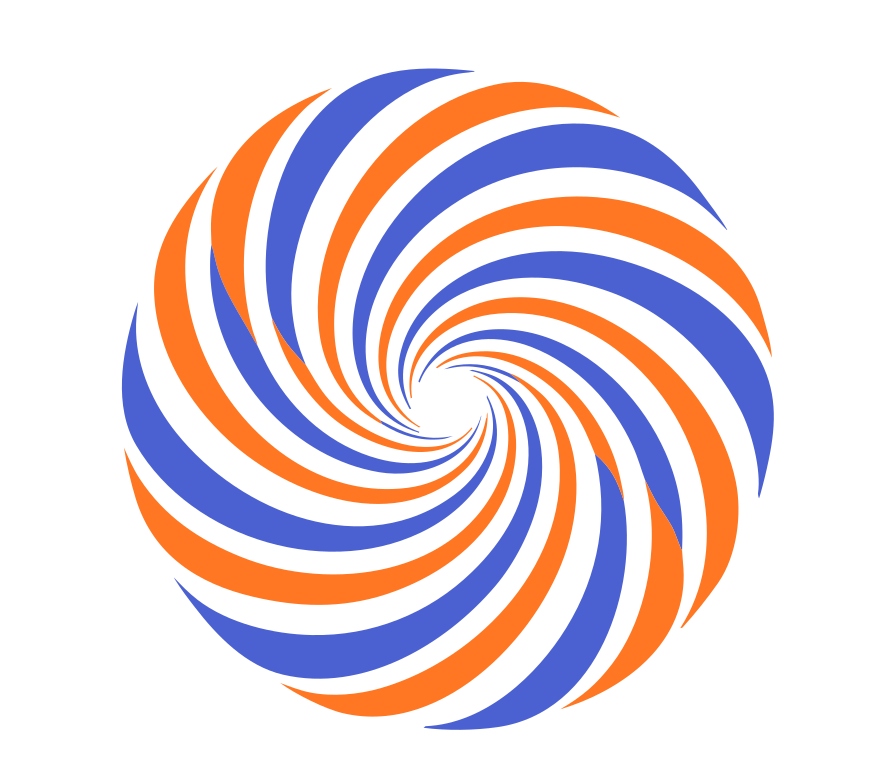

# MediaWiki Code2Code Search Branding Guide

This document defines the visual identity and branding standards for the **MediaWiki Code2Code Search** project. It is intended for developers, maintainers, and contributors to ensure consistency across the application and its documentation.

---

## 1. Concept: The Code Vortex
The visual identity is centered around the "Code Vortex" concept. It represents the deep indexing and retrieval of code within the MediaWiki ecosystem.
- **Symbolism**: The circular motion suggests scanning and search, while the brackets signify the code environment.
- **Core Colors**: A high-contrast pairing of deep tech blue and vibrant energy orange.

---

## 2. Color Palette
To maintain brand integrity, use only these official colors.

| Color | Name | Hex | Usage |
| :--- | :--- | :--- | :--- |
|  | **Savoy Blue** | `#4B61D1` | Primary identity, headers, buttons |
|  | **Indian Saffron** | `#FF7722` | Accents, highlights, call-to-actions |
|  | **Deep Coal** | `#1E1E1E` | Primary background (Dark Mode) |

---

## 3. Logo Assets
Available in `assets/branding/`. Use the SVG format for all web and documentation purposes to ensure crisp scaling.

### 3.1 Vertical Logo
**File**: `logo-vertical.svg`  
**Purpose**: Primary logo for splash screens, centered layouts, and about pages.  

### 3.2 Horizontal Logo
**File**: `logo-horizontal.svg`  
**Purpose**: Secondary logo for navigation bars, headers, and footer layouts where vertical space is limited.  

### 3.3 Minimalist Icon
**File**: `logo-minimal.svg`  
**Purpose**: Square-format icon for avatars, social media previews, and mobile app icons.  

---

## 4. System Icons & SEO
We use a dual-icon strategy to balance modern aesthetics with search engine compatibility.

- **SVG Favicon (`logo-minimal.svg`)**: Linked in `index.html` for modern browser tabs. Provides high-resolution rendering.
- **ICO Favicon (`favicon.ico`)**: Provided for legacy compatibility and optimal indexing by **Googlebot/Bingbot**.

---

## 5. Typography
The project uses geometric and modern typefaces to reflect its technical nature.

| Component | Font Stack | Notes |
| :--- | :--- | :--- |
| **Headings** | `Sora`, sans-serif | Primary brand font (Modern, Bold) |
| **Interface** | `Ubuntu`, `Segoe UI`, sans-serif | Clean legibility for UI elements |
| **Code** | `Fira Code`, `monospace` | Monospaced for technical snippets |

---

## 6. Usage Guidelines
- **Padding**: Ensure a minimum clear space of 10% around the logo.
- **Backgrounds**: Logos are optimized for dark backgrounds (`#1E1E1E`). For light backgrounds, ensure sufficient contrast for the Indian Saffron accents.
- **Scaling**: Do not scale logos below 32px width for the horizontal variant or 64px for the vertical variant.
